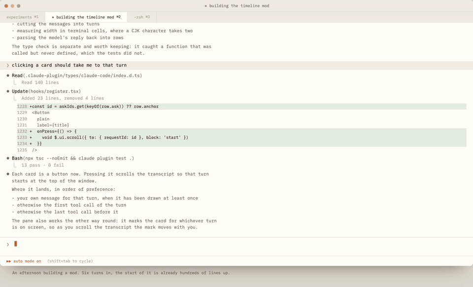

# Timeline for Claude Code

A [Claude Code mod](https://code.claude.com/docs/en/plugins/mods/overview) that
puts a timeline beside the transcript: one card per prompt, showing what you
asked, what Claude did, and what it actually touched. Built for long sessions.



<details>
<summary>▶ Full-resolution video (1 min)</summary>

https://github.com/user-attachments/assets/6dc32523-1bf8-4dd6-8b6d-c505f1e4daf9

</details>

## How to install

Inside Claude Code (v2.1.287 or later):

```
/plugin marketplace add yunjiaz7/claude-timeline-mod
/plugin install timeline@claude-timeline-mod
```

Choose **Install for you**, then **Save configuration**. Then type `/timeline`
to open the pane, and again to close it.

The pane sits beside the transcript with the fullscreen renderer
(`/tui fullscreen`); without it, it opens below.

Other ways to install, from a terminal or a clone: see the [guide](docs/guide.md#other-ways-to-install).

## What you get

- **A card per prompt**: your ask in one line, `→` what Claude did, a grey line
  of the files and commands it touched (counted, no model involved), and `⚠`
  errors word for word.
- **Click a card** to jump to that turn.
- **Scroll the transcript** and the card for what you are reading stays marked.
- **Search by meaning** in the box at the top.
- **A usage line**: context window, 5-hour and 7-day limits.

## Commands

| Command | What it does |
|---|---|
| `/timeline` | Open the timeline pane. Run it again to close it. |
| `/timeline find <words>` | Search your past prompts by meaning, e.g. `/timeline find where we added tests`. |
| `/timeline find` | Show or hide the search box at the top of the pane. |
| `/timeline lang <language>` | Write summaries in another language, e.g. `/timeline lang Chinese`. Without a language, shows the current one. |
| `/timeline replies off` | Stop writing the "what Claude did" line, to save tokens. `/timeline replies on` brings it back. |
| `/timeline cost` | Show how many tokens the summaries have used, with an estimate in dollars. |
| `/timeline help` | List every command and your current settings. |

All commands, settings and where the pane draws: see the [guide](docs/guide.md).

## Cost and privacy

Summaries are written by Haiku on your own Claude account. Nothing is spent
while the pane is closed, and each summary is written once. In one session,
118 prompts took 3.8k input and 1.9k output tokens, too few to move the
5-hour usage meter on a Max 20x plan.

Everything goes through your own Claude Code session; the mod has no network,
file or process access of its own. Exactly what is sent and stored: see the
[guide](docs/guide.md#data-and-privacy).

## Performance

Scrolling the transcript is where the pane costs the most. Claude Code has no
event for "the transcript scrolled", so to keep the marked card in step the mod
reads the position each message reports as it is drawn, and checks once more
shortly after a scroll stops. While the newest prompt is on screen it skips
those checks.

### How it got lighter

In the first version, knowing which message you are reading and showing it
on its card were one blunt action: redraw every message on screen, five times
a second, so that each one would report where it was. The mods API offers two
finer tools, and splitting the job between them is what made the difference:

- **Knowing where you are.** Claude Code redraws messages as you scroll anyway,
  and each one reports its position when it is drawn. The mod listens instead
  of asking.
- **Showing it.** The marked card lives in the mod's state, and a change to
  that state redraws only the pane that reads it, never the transcript.

It also skips checking while the newest prompt is on screen, since its card
is then the marked one.

Extra CPU cost of using the mod with the pane open, on an Apple M4 with Claude
Code 2.1.289 (percent of one core, on top of what Claude Code uses without it):

| | First version | Now |
|---|---|---|
| Scrolling the transcript | 11% | 5.3% |
| Sending a short prompt | 4.4% | 2.3% |

About half, in both cases. The first version was measured in an earlier
session, so compare these extra costs rather than raw totals.

### How it was measured

A scripted terminal (200×50) drives the same session with and without the
mod, alternating between them: 30 s untouched, 20 s of mouse-wheel scrolling
at five ticks a second, and one short prompt. CPU time is read from `ps`
before and after each step. Identical runs differ by up to about 1–2%, so
smaller differences are noise.

## Troubleshooting

- **`Unknown command: /timeline`** after installing from a terminal: run
  `/reload-plugins`, or start a new session.
- **The pane is blank**: a dim `timeline: ui.render …` line in the transcript
  says why. Please open an issue with it.

More in the [guide](docs/guide.md#troubleshooting).

## Develop

See the [guide](docs/guide.md#develop).

## License

[MIT](LICENSE)
